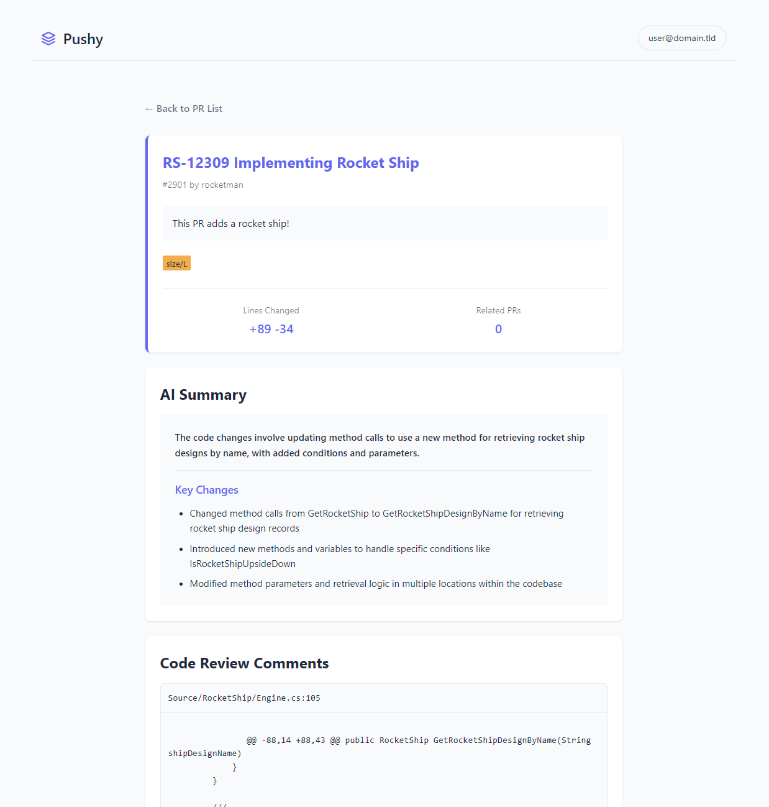

# Pushy

A Cloudflare Worker application that integrates GitHub and JIRA for managing pull requests and deployments.

## Screenshots

### Dashboard View


### PR Details View


## Features

- List last 10 merged PRs from a specified GitHub repository and branch
- Merge PRs into a demo branch
- Trigger GitHub Actions
- JIRA integration for issue tracking
- OpenAI-powered code summaries with KV caching

## Setup

1. Install dependencies:
```bash
npm install
```

2. Configure your Cloudflare account:
```bash
npx wrangler login
```

3. Create KV namespace for caching:
```bash
# Create production namespace
npx wrangler kv:namespace create "SUMMARIES_CACHE"
# Create preview namespace for development
npx wrangler kv:namespace create "SUMMARIES_CACHE" --preview
```

4. Update `wrangler.toml` with the KV namespace IDs from step 3:
```toml
kv_namespaces = [
  { binding = "SUMMARIES_CACHE", id = "your_production_id_here", preview_id = "your_preview_id_here" }
]
```

5. Configure secrets in the Cloudflare dashboard:
- `JIRA_API_KEY`
- `JIRA_USERNAME`
- `GITHUB_TOKEN`
- `OPENAI_KEY`

6. Update `wrangler.toml` with your configuration:
- `JIRA_URL`
- `TARGET_REPO`
- `TARGET_BRANCH`
- `DEMO_BRANCH`
- `GITHUB_ACTION_NAME`

## Deployment

Deploy to Cloudflare Workers:
```bash
npx wrangler deploy
```

## Caching

The application uses Cloudflare KV to cache OpenAI-generated code summaries:
- Summaries are cached for 24 hours
- Cache keys are generated using SHA-256 hashing of diff content
- Reduces OpenAI API calls and improves response times

## Security

- All sensitive information is stored as Cloudflare secrets
- GitHub token requires appropriate repository permissions
- JIRA credentials are stored securely
- OpenAI API key is stored as a Cloudflare secret